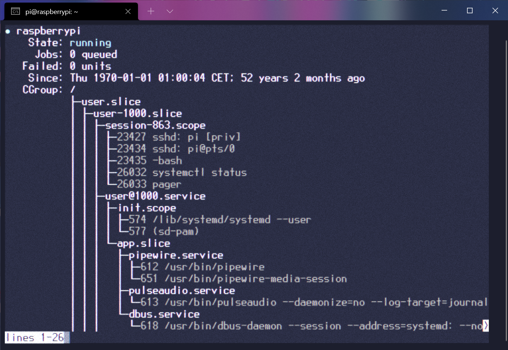

# winterm-retro-shader
A retro/cyberpunk-style shader for Windows Terminal. This is a tweaked version from the stock [Retro shader](https://github.com/microsoft/terminal/blob/main/samples/PixelShaders/Retro.hlsl) from Windows Terminal.



### Used in this screenshot:

- Font: ```Px437 Wyse700b-2y``` from the [The Ultimate Oldschool PC Font Pack](https://int10h.org/oldschool-pc-fonts/readme/)
  - [Iosevka](https://typeof.net/Iosevka/) also looks great with this shader
- Color scheme: ```Serendipity Midnight``` from [Windows Terminal Themes](https://github.com/atomcorp/themes)
- HLSL Noise functions from [this h3r gist](https://gist.github.com/h3r/3a92295517b2bee8a82c1de1456431dc)

## Features

- Scanlines (from original shader, toned down)
- Blur (from original shader, toned down)
- Chromatic aberration
- Noise


## Installing

To install, clone this repository somewhere and add this line to your Windows Terminal configuration (changing the path to the location where you cloned the repository):

```json
"experimental.pixelShaderPath": "D:\\git\\winterm-retro-shader\\retro.hlsl"
```

You can change some parameters of the shader by editing the ```retro.hlsl``` file:

```c
// Scanline parameters
#define SCANLINE_FACTOR 0.3
#define SCALED_SCANLINE_PERIOD Scale
#define SCALED_GAUSSIAN_SIGMA (2.0*Scale)

// Noise parameters
#define NOISE_AMOUNT 0.3

// Chromatic Aberration parameters
#define CHROMATIC_SPREAD 1.3 
```

The font and the color scheme used are available on the ```res/``` folder. To install the font, right-click it and select "Install", and it should appear on Terminal's settings. To add the color scheme, append the contents of the .json file to your configuration file, under the ```"schemes"``` key.